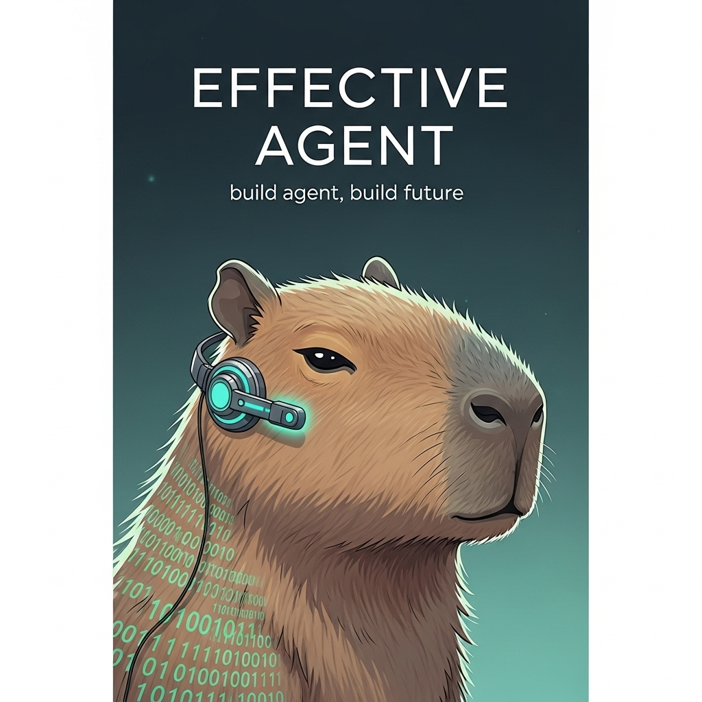

# Effective Agent

> 构建稳健、可靠、高效的智能体

## 🎯 项目概述

Effective Agent 是一个专注于智能体开发最佳实践的项目，致力于帮助开发者构建更加稳健、可靠和高效的AI智能体系统。

## 🚀 目录
- [第1章 引言](CH01-引言.md)
- [第2章 智能体基础：核心原则与设计](CH02-智能体基础：核心原则与设计.md)
- [第3章 智能体的心智:推理与规划](CH03-智能体的心智：推理与规划.md)

## 📖 主要内容

- 智能体架构设计原则
- 最佳实践与开发规范
- 常见问题解决方案
- 性能优化策略

## 📚 文档结构

- `/asset/` - 项目资源文件
- 更多文档内容正在完善中...

## 🤝 贡献指南

欢迎提交 Issue 和 Pull Request 来完善这个项目。

## 📄 许可证

本项目采用 MIT 许可证。

---

**让每个智能体都更加高效可靠** ✨
